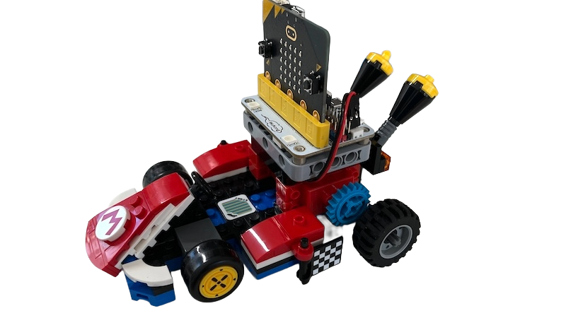

# LEGO Mario Kart + micro:bit Controller

Smooth controls for LEGO Mario Kart using LEGO Mario figure + BBC micro:bit

---

## 📖 About
This project lets you control a LEGO Mario Kart using LEGO Mario's built‑in IMU and send **smooth throttle/steering** commands to a BBC micro:bit over Bluetooth.
It started as a toy experiment but evolved into smooth, proportional control that makes driving faster, more precise, and way more fun—especially for kids!


Inspired by [RickP/lego_mario_controller](https://github.com/RickP/lego_mario_controller)

---

## 🎯 Features
- Bluetooth LE bridge from **macOS (Python + Bleak)** to **micro:bit (UART/NUS)**.
- Smooth analog control with continuous **throttle** (−1.0 … +1.0) and **steering** (−1.0 … +1.0).
- micro:bit v2 **MakeCode** with [WuKong](https://www.elecfreaks.com/learn-en/microbitExtensionModule/wukong.html) motor controller.
- Tested with **LEGO set 72043**.

---

## 🛠 Requirements
### Hardware ###
- LEGO Mario figure with Bluetooth enabled
- LEGO Mario Kart 72043 (or your own wheeled LEGO build), it doesn't matter.
- BBC micro:bit **v2** with [WuKong](https://www.elecfreaks.com/learn-en/microbitExtensionModule/wukong.html) motor driver board
- Geekservo (aka Geekmotor) — e.g. [KittenBot Red Geekservo](https://www.kittenbot.cc/products/kittenbot-red-geekservo-motor?srsltid=AfmBOooTMd0F47peWlP_WttThHysRFdQFGK_tqafHXt6cpBw5pCdkloi)

> Notes: Counts are per kart. Colors don’t matter. Equivalent parts are fine.

### BrickLink Studio 3D-model
- I published a modified Kart 3D model on BrickLink. See the full parts list in the: [BrickLink Studio 3D Model](https://www.bricklink.com/v3/studio/design.page?idModel=720622)

### Additional LEGO elements (not included in the base 72043 set)

**Technic gears (blue, used in this build)**
- 2× `6396479`
- 2× `69779`

**Alternative gears (tested, faster gearing, easier to source)**
- 2× `10928 (3647)`
- 2× `3648`

**Structural System parts (colors don’t matter)**
- 1× `4210998`
- 2× `4654580`
- 2× `6083620`
- 6× `4210719`
- 1× `303426`
- 2× `6225230`
- 4× `6092585`

**Technic beams (to mount Geekservos to the WuKong board)**
- 2× `4210686`
- 8× `6279875`

**Tyres and rims**
- 2× Tyre `30391` (or equivalent)
- 2× Rim `55981` (or equivalent)


### Software ###
- macOS with Bluetooth LE (developed on Apple M1 15.6 Sequoia)
- Python **3.9+**
- Bleak **0.21.x**

---

## 📂 Structure
```
/bridge
    mario_bridge.py             # macOS BLE bridge (Mario -> micro:bit)
    mario_microbit_scan.py      # helper: list BLE devices for sanity check
/microbit
    microbit_mario_kart_driver.hex    # MakeCode micro:bit program
```

---

## 🧱 Build Steps for LEGO 72043 set

**Step 1 — Modify the rear axle of the kart**
- Rear axle (rear view): 
- Rear axle (alternate rear view): 
- Additional view with the blue gear installed: 

**Step 2 — Build the micro:bit + Geekservo module**
- Create the micro:bit + Geekservo motors block as shown:
  - Main view. Connect M1 to the Left motor, and M2 to the Right motor: 
  - Side view: 
  - Bottom view: 

**Step 3 — Join the kart and the module**
- Connect the kart and the micro:bit module together:
  - Assembled view: 
  - Final assembly: 

---

## 🚀 Quick Start

### 1) Clone the repo
```bash
git clone https://github.com/maxxlife/interactive_microbit_mario_kart_toy.git
cd interactive_microbit_mario_kart_toy
```

### 2) Install dependencies

#### Option A) Conda Manual Env Setup
```bash
conda create -n lego_mario python=3.9
conda activate lego_mario
pip install -r requirements.txt
```

#### Option B) Conda Declarative Env Setup
```bash
conda env create -f environment.yml
conda activate lego_mario
```
_Note (macOS): The Conda environment includes the PyObjC bits Bleak needs for CoreBluetooth._

### 3) Flash the micro:bit
- Open **MakeCode**, import `microbit/microbit_mario_kart_driver.hex`.
- Ensure Bluetooth **UART** service is enable, and No Pairing required is set 
- Flash to the micro:bit.

### 4) (Optional) Scan to verify Mario + micro:bit visibility
```bash
cd bridge
python mario_microbit_scan.py
```
**Example terminal output:**
```
% python mario_microbit_scan.py
Scanning for Bluetooth LE devices (5s)…
- BBC micro:bit [tapag] (E9F4DD5B-E022-4C3A-E889-784AB44424A5) UUIDs: []
- Mario asr5 (DC2BBB46-1DBE-BFBF-5C54-4971BDEE1F78) UUIDs: ['00001623-1212-efde-1623-785feabcd123']

Summary:
LEGO Mario found
micro:bit found
```
If both devices are in **Summary**, you’re ready to bridge.

### 5) Run the BLE bridge (recommended defaults)
```bash
# If you used Conda:
conda activate lego_mario

cd bridge
python mario_bridge.py --x-scale 28 --z-scale 32 --deadzone 0.08 --expo 1.3
```
Hold Mario **still** for ~0.5 s while the bridge calibrates center (bias).  
Then drive your Mario Kart with smooth control 🚗💨

---

## 🎛️ Tuning & Controls

The bridge reads Mario IMU (roll -> **x**, pitch -> **z**), smooths via EMA, subtracts a **bias** (captured at startup), then maps to analog outputs.

**Analog output format (10 Hz):**
```
<throttle>,<steer>:
```
- Floats in **[−1.00 … +1.00]**
- `throttle > 0` = forward, `< 0` = reverse
- `steer > 0` = right, `< 0` = left
- Each line ends with a colon `:` and newline `\n` so the micro:bit can `readLine()` safely.

**CLI flags (feel dials):**
- `--x-scale <float>` – Steering sensitivity (**larger = less sensitive**). Start 28–36.
- `--z-scale <float>` – Throttle sensitivity (**larger = less sensitive**). Start 28–36.
- `--deadzone <float>` – Neutral band around center; start at **0.08–0.15** if the kart creeps.
- `--expo <float>` – Exponential response; **1.2–1.5** gives softer center and punchy ends.
- Optional: `--invert-x`, `--invert-z` to flip axes if your build feels backward.

**Typical workflow**
1. Get neutral correct -> raise **deadzone** until idle is stable.  
2. Set overall feel -> tweak **x/z-scale** for sensitivity.  
3. Refine center -> adjust **expo** for smoother micro-movements.  
4. Invert if needed.

**micro:bit motor mix (WuKong):**
```python
# After parsing throttle, steer in [-1.0, 1.0]
left  = clamp((throttle + steer) * 100, -100, 100)
right = clamp((throttle - steer) * 100, -100, 100)
# Map to WuKong motor speed %
```
MakeCode tip: `readLine()`, check it **ends with “:”**, then `split(",")` and convert to numbers.

**Timing**
- Streams at **10 Hz** (`TICK_SEC = 0.10`)
- Sends latest filtered values on each tick

---

## 🎥 Demo Videos
- ✅ Final result — smooth analog control *(if everything is done correctly)*: [Watch on YouTube](https://youtu.be/rKxqxzlykEc?si=mdo-XMajJeAXglYa)
- 🧪 Early prototype — discrete controls *(kid test, pre-smooth controller)*: [Watch on YouTube](https://youtu.be/yoFcOfaX25s?si=mNUHv1ItuKjsj6jZ)


---

## 🧰 Troubleshooting
- **Mario not found** -> press Mario’s Bluetooth button to (re)advertise.
- **micro:bit not writable** -> ensure UART (NUS) characteristic is used and not busy.
- **Kart creeps at rest** -> increase `--deadzone` or hold Mario steadier during startup.
- **Laggy feel** -> lower tick interval or reduce extra filtering in MakeCode side.

---

## 📜 License
MIT License – free to use, share, and modify.
